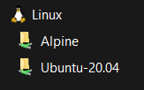
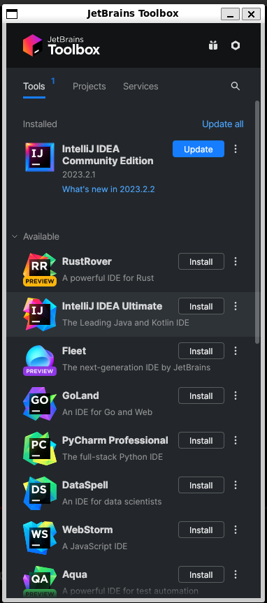

# Configurando WSL2 com Intellij

Neste breve tutorial faremos uma configuração para instalação da IDE [Intellij](https://www.jetbrains.com) no WSL2 usando o [Ubuntu-20.04](https://ubuntu.com/wsl), caso nunca tenha feito a instalação desta distro no seu WSL2 minha sugestão é começar [Configurando o WSL com o Ubuntu](https://github.com/Wesleyotio/config-wsl-with-ubuntu-zsh).

Depois de ter realizado a configuração mencionada estaremos prontos para dar inicio, importante também enfatizar que esse tutorial foi inspirado pelo video [instalando o Intellij dentro do wsl2](https://www.youtube.com/watch?v=v-e8MRhNkmU) do canal [CodaRAM](https://www.youtube.com/@codaram).

# Índice

- [Configurando WSL2 com Intellij](#configurando-wsl2-com-intellij)
- [Índice](#índice)
  - [Instalando uma interface gráfica no WSL](#instalando-uma-interface-gráfica-no-wsl)
  - [Instalando a IDE pelo JetBrains Toolbox App](#instalando-a-ide-pelo-jetbrains-toolbox-app)
  - [Instalando o JAVA e o Maven](#instalando-o-java-e-o-maven)
    - [Java](#java)
    - [Maven](#maven)
  - [Configurando o JAVA e o Maven no Intellij](#configurando-o-java-e-o-maven-no-intellij)

## Instalando uma interface gráfica no WSL

Sim, meu camarada é possível instalar uma interface gráfica para seu WSL2, fazemos isto rodando o comando.

```sh
sudo apt install nautilus -y
```
## Instalando a IDE pelo JetBrains Toolbox App

Basicamente vamos baixar o [toolbox APP](https://www.jetbrains.com/toolbox-app/) e fazer a instalação no WSL2, o interessante aqui é que você pode ter todas a ferramentas deles dentro do WSl, mas neste caso estamos focados no [JAVA](https://www.java.com), com já citado a ferramenta vai ficar instalada dentro do WSL então baixe o arquivo da extensão **.tar.gz** usando sua interface do windows encontre o diretório da distro.

  

Dentro do diretório da distro jogue onde quiser o arquivo, lembre que depois de descompactado e instalado ele não terá mais utilidade.

```sh
sudo tar -xzf <nome-do-arquivo>.tar.gz -C /opt
```

Feito isso agora temos o arquivo descompactado na pasta `/opt` navegue até esta pasta e encontre o diretório **com mesmo nome do arquivo** descompactado.

```sh
cd /opt

cd <nome-do-arquivo>
```

Neste diretório roda o comando para iniciar a instalação de fato do tool box.

```sh
./jetbrains-toolbox
```
Se tudo estiver saindo como o esperado teremos a seguinte tela.

  

No meu caso já tenho instalado o Intellij IDEA Community, mas posso atualiza-lo ou instalar qualquer outras ferramentas. Feito isso, temos que fazer nossa IDE ficar acessível para o windows usando os seguintes comandos.

navegamos até o diretório e executamos um `ls`
```sh
  cd ~/.local/share/applications
  ls
```
O **resultado** é algo parecido com as linhas apresentadas abaixo.
```sh
jetbrains-idea-ce-566a045c.desktop  
jetbrains-toolbox.desktop  
```
Agora executamos o comando: 
```sh
sudo cp *.desktop /usr/share/applications
```
Se tudo estiver certo temos a seguinte imagem aparecendo no seu menu do windows, permitindo abrir o Intellij Community de dentro do WSL2


## Instalando o JAVA e o Maven

Para instalar o [JAVA](https://www.java.com/) e o [Maven](https://maven.apache.org) no Linux Ubuntu é simples, inicialmente vamos executar os seguintes comandos.
### Java
Para atualizar o sistema
```sh
sudo apt update
```
Instalando o JRE(Java Runtime Environment)
```sh
sudo apt install default-jre
```
Verificando se a instalação está correta

```sh
java -version
```
A resposta deve ser algo como

```
openjdk version "11.0.20.1" 2023-08-24

OpenJDK Runtime Environment (build 11.0.20.1+1-post-Ubuntu-0ubuntu120.04)

OpenJDK 64-Bit Server VM (build 11.0.20.1+1-post-Ubuntu-0ubuntu120.04, mixed mode, sharing)
```
Pronto, de maneira semelhante temos que vamos instalar o JDK(Java Development Kit)

```sh
sudo apt install default-jdk
```
Verificando se a instalação está correta

```sh
javac -version
```
E sua resposta deve ser:
```
javac 11.0.20.1
```
### Maven

Observe que para o Maven fazemos também 3 passo
```sh
sudo apt install maven
```
Verificando se a instalação está correta

```sh
mvn -version
```
E sua resposta deve ser:
```
Apache Maven 3.6.3
Maven home: /usr/share/maven
Java version: 11.0.20.1, vendor: Ubuntu, runtime: /usr/lib/jvm/java-11-openjdk-amd64
Default locale: en, platform encoding: UTF-8
OS name: "linux", version: "5.15.90.1-microsoft-standard-wsl2", arch: "amd64", family: "unix"
```

## Configurando o JAVA e o Maven no Intellij

Temos IDE, Linguagem de programação e gerenciador de pacotes em pleno funcionamento o que nos falta agora é fazer Nossa IDE reconhecer a localização do Java e do repositório do Maven o `.M2`  

Com sua IDE aberta digite o comando `Ctrl + Alt + s` para abrir as configurações, procure por `Build, Execution, Development > Build Tools > Maven` e preencha os campos com os seguintes valores.

Maven home path: `/usr/share/maven`

User settings... `/home/<seuUsuario>/.m2/settings.xml`

Local repository... `/home/<seuUsuario>/.m2/repository`


Para terminar procure por  `Build, Execution, Development > Build Tools > Maven > Runner` e no campo do JRE coloque 

JRE: `/usr/lib/jvm/java-1.11.0-openjdk-amd64`

****

**OBS:** Pode ser que quando você precisar instalar novos pacotes do Maven a IDE tenha algum problema e não deixe realizar o update, para esse caso verifique qual usuário é dono da pasta no diretório do usuário usando o comando:

```sh
cd ~
ls -la
```
Se o diretório `.m2` estiver com o usuário `root` então mude para o seu pelo comando:

```sh
sudo chown -R seuUsuario:seuUsuario .m2  
```
Agora sua IDE consegue atualizar sem problemas. 
